# GAPChain MVP — Open Source Agri-Blockchain

[](https://opensource.org/licenses/MIT)
[](https://hyperledger.org)
[](https://golang.org/)
[](https://vuejs.org/)

Chào mừng đến với dự án hệ thống truy xuất nguồn gốc nông sản mã nguồn mở **GAPChain**. Dự án phân tán này không được tạo ra để quảng cáo bán công nghệ, mà nhằm một mục đích duy nhất: Minh bạch hóa và bảo vệ hệ sinh thái nông sản sạch tại Việt Nam.

**Chúng tôi cần sự chung tay của cộng đồng.** GAPChain MVP hiện đang chạy thành công và ổn định tại môi trường local (Hyperledger Fabric 3.1.1 - 4 Orgs, 2 Channels). Chúng tôi đang tìm kiếm các nhà phát triển (Blockchain Engineers, Backend Golang, DevOps, Flutter) dũng cảm nộp Pull Request để cùng đưa dự án này lên Production!

---

## 1. Tại Sao Đáng Để Bạn Đóng Góp?

GAPChain không phải là một ứng dụng web CRUD tẻ nhạt. Khi tham gia codebase này, bạn sẽ cọ xát với kiến trúc Distributed Ledger giải quyết các bài toán có chiều sâu kỹ thuật:

1. **Token hóa sản lượng:** Chaincode lifecycle đảm bảo thu hoạch đúng 1 tấn nông sản, hệ thống chỉ phát hành số token tương đương. Vô hiệu hóa thủ đoạn "xin thêm mã QR" để trà trộn hàng giả.
2. **Audit trail bất biến tuyệt đối:** `GetHistoryForKey` trên CouchDB trả về toàn bộ vòng đời thay đổi dữ liệu lô hàng. Không quản trị viên nào có thể sửa ngược lịch sử sau khi đã commit.
3. **Anti-clone QR địa lý:** Tích hợp logic xử lý Log (Event-driven) phát hiện 1 mã QR bị in giả và quét đồng thời ở 2 tọa độ cách biệt trong khoàng thời gian vô lý => Cảnh báo đỏ real-time.
4. **Burn token on-chain:** Chú trọng vòng đời tem số. Người mua ấn nút xác nhận sở hữu sẽ tự động "đốt mã" trên chuỗi, chặn đứng khả năng lừa đảo tái sinh vỏ hộp vật lý cũ.
5. **MSP identity enforcement:** Kiểm soát phân cấp bảo mật quyền gọi hàm nghiêm ngặt qua chữ ký số. Ví dụ: Chỉ tổ chức có MSPID `ChiCucBVTV` mới invoke được lệnh cấp phép lưu hành.

> 🛠️ *"Bất kể là một dòng cấu hình CI/CD hay một core module phức tạp, mọi contribution của bạn đều sẽ được review thân thiện, merge và cấp credit vĩnh viễn trong portfolio dự án."*

---

## 2. Bảng Yêu Cầu Tính Năng (Roadmap & Help Wanted)

- [x] **Phase 1: Local MVP (✅ Đã Hoàn thành)** 
  - Khởi tạo kiến trúc 4 Tổ chức, thiết lập ứng dụng giao thức gRPC hiện đại qua `fabric-gateway-go` v1.x.
  - Xây dựng 3 Smart Contract bằng Golang: `lohang_cc`, `nhatky_cc`, `giao_dich_cc`.
  - Frontend Consumer QR Portal chạy ổn định bằng nền tảng Vue 3.
- [ ] **Phase 2: Cloud Deployment (🔥 Good First Issues)**
  - Lên kịch bản **CI/CD Pipeline** tự động test & build qua GitHub Actions.
  - Setup kịch bản **Docker Compose Production**, phục vụ deploy lên kiến trúc AWS GCP hoặc VPS Bare-metal chuyên nghiệp.
  - Giám sát trạng thái cụm Network với **Prometheus + Grafana dashboards**.
  - Đẩy độ phủ (Coverage) tích hợp cho Go Chaincode lên `>70%` bằng Ginkgo / Go Test.
- [ ] **Phase 3: Pilot Thực Tế trên Đồng Ruộng**
  - Hoàn thiện ứng dụng Flutter Mobile, xử lý vấn đề đồng bộ dữ liệu **Offline-first Sync** (khi nông dân vào rẫy mất mạng 4G).
  - Viết module hash ảnh chụp (SHA256) và khóa GPS ngầm định đưa vào payload blockchain.
  - Cài đặt giao diện **Hyperledger Explorer**.

---

## 3. Tổng quan Kiến Trúc & Tech Stack

GAPChain sử dụng kiến trúc phân tán đa lớp dựa trên Hyperledger Fabric.



### 3.1 Tech Stack
- **Blockchain**: Hyperledger Fabric v3.1.1.
- **Smart Contracts (Chaincode)**: Golang 1.19+ (sử dụng `fabric-chaincode-go/v2`, `fabric-contract-api-go/v2`).
- **State DB**: CouchDB (cho phép truy vấn Rich JSON queries).
- **Backend API**: Golang 1.21+ (Gin framework, `uber-go/fx` cho DI).
- **Mobile App**: Flutter 3.x, Riverpod, sqflite.
- **Web App**: Vue 3, Vite, Tailwind CSS.

### 3.2 Cấu trúc Mạng (Network Topology)
Hệ thống mạng bao gồm 4 tổ chức (Organizations):
1. **PlatformOrg** (`platform.gapchain.vn`): Đơn vị vận hành tổng, xử lý thu hồi khẩn cấp.
2. **HTXNongSanOrg** (`htxnongsan.gapchain.vn`): Đơn vị canh tác, vận hành tạo lô hàng, viết nhật ký.
3. **ChiCucBVTVOrg** (`chicucbvtv.gapchain.vn`): Cơ quan nhà nước kiểm duyệt, cấp chứng nhận tiêu chuẩn.
4. **NPPXanhOrg** (`nppxanh.gapchain.vn`): Nhà phân phối siêu thị mua hàng.

Chạy trên 2 kênh bảo mật độc lập:
- `nhatky-htx-channel`: Chạy hợp đồng `lohang_cc` & `nhatky_cc` (Platform, HTX, BVTV).
- `giaodich-channel`: Chạy hợp đồng `giao_dich_cc` (Platform, HTX, NPP).

---

## 4. Quy Tắc Nghiệp Vụ Cốt Lõi (Business Rules cho Dev)

### 4.1 Tách Bóc Lô Hàng (Batch Splitting - `lohang_cc`)
- Dành cho định tuyến bán lẻ linh hoạt. Lô con được sinh ra từ lô mẹ nhưng quản lý độc lập bằng tham chiếu `ma_lo_me`. Khi Tạo giao dịch B2B, Backend phải kiểm tra **lượng mua không vượt quá `so_luong_con_lai` của tổng kho**.

### 4.2 Lớp Xác Thực Dữ Liệu (Farmer Bridge - `nhatky_cc`)
- Áp dụng xác minh 2 lớp: Nông dân (Layer 1) và Cục BVTV (Layer 2). Chỉ bản ghi có cờ `da_duyet` mới được hiển thị trên web nội dung cho khách hàng quét mã cuối (Consumer QR).

### 4.3 Khóa Chéo Xuyên Kênh (Cross-Channel Saga) 
- Khi tạo giao dịch ở channel kia, phải trả Message update số lượng cho channel gốc. Việc này bắt buộc thực thi thông qua **Eventual Consistency / Retry Queues**, không call đồng bộ nhằm tránh ngẽn mạch toàn cục.

---

## 5. Hướng Dẫn Phát Triển Backend (Golang)

Backend có vai trò Proxy làm sạch dữ liệu và xử lý bảo vệ JWT.

```text
gapchain/backend/
├── cmd/server/             # Tệp khởi chạy chính, quản lý DI uber-go/fx
├── internal/
│   ├── infrastructure/     # Driver (fabric/gateway.go), Repos Kafka
│   ├── repository/fabric/  # EvaluateTransaction (Khớp/Đọc), SubmitTransaction (Commit/Ghi)
│   ├── middleware/         # Check Security Context, Authentication
│   └── model/              # HTTP DTO Objects
```
Tất cả client kết nối xuống Hyperledger bắt buộc sử dụng cơ chế **Gateway gRPC API (v1.x)** mới.

---

## 6. Deployment: Môi trường Local

Bạn cần Docker + Docker Compose để clone mạng mô phỏng.

```bash
cd gapchain/chain-setup
export PATH=$PATH:$(pwd)/../bin

# 1. Dựng mạng Fabric (9 containers đang chạy: 1 Orderer, 4 Peers, 4 CouchDB)
./scripts/setup-network.sh

# 2. Đóng gói & Deploy các chaincodes (lohang, nhatky, giaodich)
./scripts/deploy-chaincode.sh

# 3. Kích hoạt Middleware Backend
cd ../backend
go run cmd/server/main.go
# Server sẽ lắng nghe ở localhost:8080

# 4. Truy cập QR Dev Web
cd ../frontend-web
npm install && npm run dev
```

> **Mẹo Local:** Dọn dẹp Network hoàn toàn bằng lệnh: `./scripts/cleanup-network.sh --remove-images`.

---

## 7. Tiêu chí Quy Ước Mở (Coding Standards)

1. Mọi object JSON trong Database CouchDB tuân thủ định dạng `snake_case`. Tên func ngoài Chaincode (Exported methods) thiết lập chuẩn theo tiếng Việt không dấu dính liền (`TaoLotHang`, `GhiNhatKy`).
2. Nếu xử lý logic Timestamp thời gian ở Core blockchain, bắt buộc gọi `ctx.GetStub().GetTxTimestamp()`, tuyệt đối KHÔNG gọi `time.Now()` hạn chế mismatch orderer consensus.
3. Tạo nhánh phát triển trên Git tuân thủ format: `feature/xyz` hoặc `bugfix/xyz`. Sẵn sàng mở PR (Pull Request) ngay khi hoàn thiện. 

🌟 _Cùng nhau, chúng ta sẽ biến những dòng code khô khan thành hệ thống lá chắn bảo vệ thành quả của những người làm nông nghiệp tử tế._
